# 🎬 Maven Movies: Unlocking Insights for a Rental Business

## 📌 Project Overview
This project focuses on analyzing the *MAVENMOVIES* database to extract valuable insights that can enhance business operations, marketing strategies, and inventory management. SQL is extensively used to perform exploratory data analysis (EDA), understand the database schema, and answer critical business queries.

---

## 🎯 Project Goals

### 🛒 Customer Insights

- 📌 Identify customer details (names, emails) to enhance targeted marketing campaigns.
- 📊 Analyze rental behavior to improve customer engagement.

### 🎮 Movie Inventory Optimization

- 🛆 Evaluate rental inventory and categorize movies based on rental rates and availability.
- 🔍 Suggest recommendations for expanding the movie collection based on popularity and rental trends.

### 💰 Revenue Enhancement

- 📈 Examine rental pricing trends to identify profitable pricing strategies.
- 🎥 Determine the most rented movie categories and ratings to maximize earnings.

### ⚙️ Operational Efficiency

- 📌 Track and manage movie inventory efficiently.
- 📉 Identify inventory gaps and optimize stock levels.

---

## 🛠️ Tools & Technologies Used
- *SQL* – Data extraction, transformation, and querying
- *MAVENMOVIES Database* – Source of movie rental data

---

## 📊 Insights & Expected Outcomes
- 📢 *Enhanced marketing strategies* based on customer segmentation and preferences.
- 🎬 *Optimized inventory management* with improved stock replenishment strategies.
- 💵 *Increased revenue generation* through data-driven pricing and rental trends.
- 📌 *Operational efficiency* with a structured approach to inventory tracking.

---

# Movies Rental Data Queries

This repository contains SQL queries and corresponding visualizations for analyzing the Movies Rental dataset.

## Queries and Visualizations

### 1. Customer Information for Marketing Team
Retrieve customer first name, last name, and email ID.

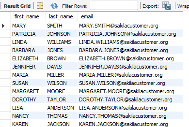

### 2. Count of Movies with Rental Rate of $0.99
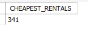

### 3. Rental Rate Distribution and Movie Count
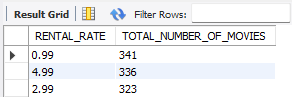

### 4. Most Common Movie Rating
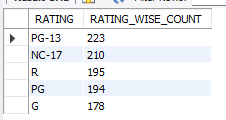

### 5. Most Prevalent Rating per Store
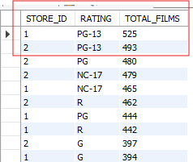

### 6. List of Films by Name, Category, and Language
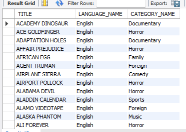

### 7. Movie Rental Frequency
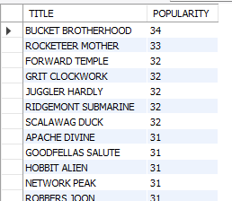

### 8. Top 10 Grossing Films
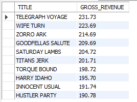

### 9. Highest Spending Customer
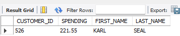

### 10. Store with Most Revenue
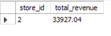

### 11. Monthly Rentals Count
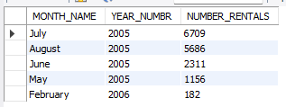

### 12. Customers Eligible for Rewards
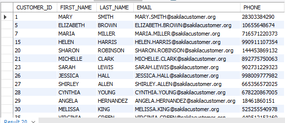

### 13. Payments from First 100 Customers
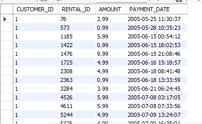

### 14. Payments Over $5 Since Jan 1, 2006
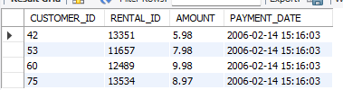

### 15. Payments Over $5 for Specific Customers
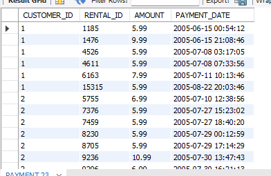

### 16. Films with 'Behind the Scenes' Special Feature
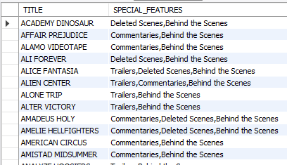

### 17. Unique Movie Ratings and Count
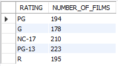

### 18. Titles Count by Rental Duration
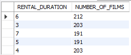

### 19. Ratings, Movie Count, Length, and Rental Duration
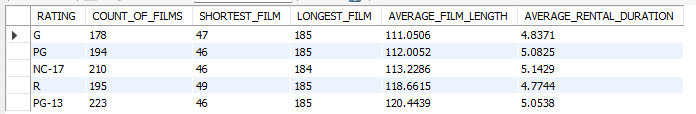

### 20. Film Count by Replacement Cost with Rental Rates
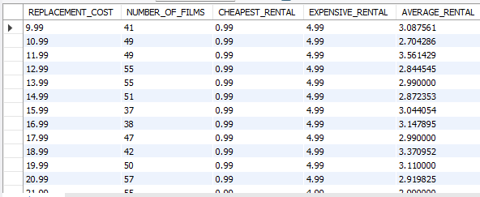

### 21. Customers with Less Than 15 Rentals
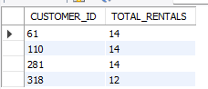

### 22. Longest Films Sorted by Length and Rental Rate
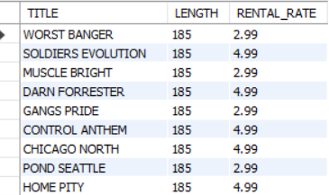

### 23. Categorization of Movies by Length

### 24. Movie Recommendations by Age Group
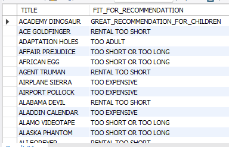

### 25. Films Inventory List
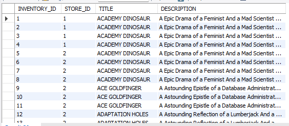

### 26. Actor Movie Count
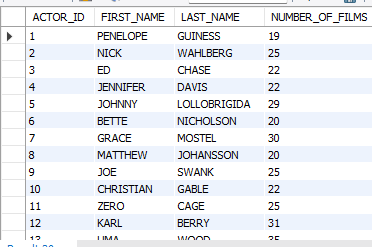

### 27. Number of Actors per Film
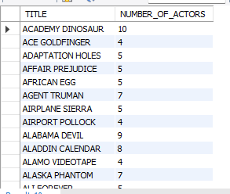

### 28. List of Staff and Advisors
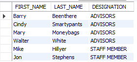

---
